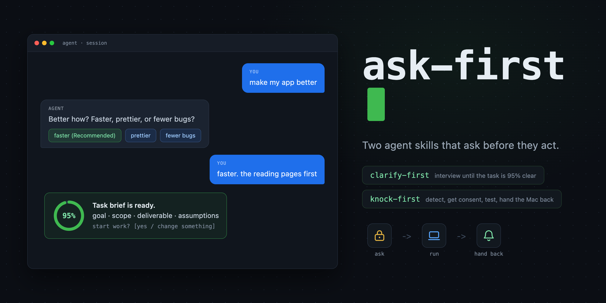

<p align="center"></p>

# ask-first

[English](README.md) | [简体中文](README.zh-CN.md) | [日本語](README.ja.md) | Français | [Deutsch](README.de.md) | [Español](README.es.md) | [Português](README.pt.md)

Deux compétences d'agent qui demandent avant d'agir.

`clarify-first` vous interroge une question à la fois jusqu'à ce que la tâche soit assez précise pour être réalisée, puis confirme un brief écrit avant tout début de travail. `knock-first` vérifie si vous êtes à l'ordinateur et obtient votre permission avant que l'agent prenne le bureau pour ses tests, puis vous prévient dès que la machine vous est rendue.

Les deux problèmes se ressemblent du point de vue de l'utilisateur : un agent devine, agit sur sa supposition, et la supposition était fausse. Demander d'abord coûte moins cher que recommencer.

## Installation

La [skills CLI](https://skills.sh) gère la détection de l'hôte pour Claude Code, Codex, Cursor, Gemini CLI, GitHub Copilot, opencode, Amp et ses autres hôtes pris en charge :

```bash
npx skills add M1688-cpu/ask-first -g
```

Ou lancez l'installateur de ce dépôt, qui détecte les agents présents sur votre machine et copie dans chacun (`--all` pour tous les agents pris en charge, `--list` pour prévisualiser, `--remove` pour désinstaller) :

```bash
git clone https://github.com/M1688-cpu/ask-first.git
bash ask-first/install.sh
```

Claude Code peut aussi l'installer comme plugin :

```text
/plugin marketplace add M1688-cpu/ask-first
/plugin install ask-first@ask-first
```

Pour une copie manuelle, voici les dossiers lus par chaque agent :

| Agent | Dossier de skills |
| --- | --- |
| Claude Code | `~/.claude/skills` |
| Codex | `~/.codex/skills` |
| Cursor | `~/.cursor/skills` |
| Gemini CLI | `~/.gemini/skills` |
| opencode | `~/.config/opencode/skill` |
| Amp | `~/.amp/skills` |
| OpenClaw | `~/.openclaw/skills` |
| ZCode | `~/.zcode/skills` |
| tout agent lisant le format ouvert | `~/.agents/skills` |

Une fois installées, les compétences se déclenchent d'elles-mêmes quand leurs conditions correspondent ; vous pouvez aussi les appeler par leur nom.

## clarify-first

Un agent qui devine sur une demande vague construit la mauvaise chose avec assurance. Cette compétence le force à demander.

Elle se déclenche quand l'objectif, le périmètre, le livrable ou une décision clé d'une demande se lit de plusieurs façons. Les demandes claires, petites et mécaniques passent sans détour, avec une reformulation en une ligne de ce que l'agent a compris.

L'entretien :

1. Une question à la fois, chacune avec 2 à 4 options et une réponse recommandée, donc la plupart des réponses sont un clic.
2. Les relances naissent de vos réponses, l'entretien converge au lieu de suivre une liste figée.
3. Ce que l'agent peut trouver dans le code, la documentation ou le web n'est jamais demandé. Seuls l'intention, le goût et les contraintes vous sont demandés.
4. Environ 7 questions est le plafond ; au-delà, l'agent pose les mauvaises questions.
5. À 95 % de confiance, il rédige un brief de tâche : objectif, inclus, exclus, livrable, hypothèses. Le travail commence après votre approbation.

```text
vous :  ajoute le mode sombre à mon site
agent : quelles parties ? Tout le site, ou d'abord les pages de lecture ?
        (recommandé : les pages de lecture d'abord, elles portent 80 % du temps
        de lecture)
vous :  les pages de lecture
agent : suivre le réglage d'apparence du système, ou ajouter son propre
        interrupteur ? (recommandé : suivre le système, un composant de moins
        à maintenir)
vous :  suivre le système
agent : Brief : palette sombre sur les pages de lecture, suit l'apparence du
        système, zone admin intacte, les tokens de palette vont dans theme.css.
        Je commence ? [oui / modifier]
```

## knock-first

Des tests qui bougent la souris et tapent au clavier peuvent entrer en collision avec la personne qui utilise la machine. Un test raté, c'est le moindre mal ; une édition perdue ou un clic égaré, c'est pire. Cette compétence fait vérifier, demander, exécuter, puis rendre la main à l'agent.

Elle se déclenche avant toute prise du bureau : captures d'écran, lancement de l'application tout juste compilée, simulation d'entrée, redimensionnement de fenêtres pour un test.

Le cycle :

1. Détecter : un script lit le temps d'inactivité du clavier et de la souris, l'app au premier plan, et si une appli de réunion ou de lecture tourne, puis indique si vous semblez présent. Quelqu'un qui regarde une vidéo sans toucher le clavier compte comme présent.
2. Demander : une seule boîte de dialogue énonce ce que la détection a trouvé, la liste exacte des actions prévues et une estimation de durée. Options : y aller, ne plus demander pendant cette session, ou pas maintenant. Le consentement n'existe que dans la conversation en cours et n'est jamais écrit nulle part.
3. Exécuter : exactement les actions listées. Tout ce qui dépasse la liste repasse par une demande.
4. Rendre : une notification macOS avec son, plus un résumé des résultats dans le chat, pour que vous sachiez à la seconde où la machine revient à vous.

```text
agent : vous travaillez dans Xcode en ce moment (inactif 40 s). J'ai besoin du
        bureau pendant environ 3 minutes pour : ouvrir l'app compilée, la
        redimensionner en 1280x800, prendre 3 captures, taper une recherche.
        On y va ? [y aller / ne plus demander cette session / pas maintenant]
vous :  y aller
        ... les tests tournent ...
agent : notification envoyée : « Tests terminés : 3 captures enregistrées. »
        Dans le chat : le plantage de la recherche ne s'est pas reproduit, les
        captures sont dans artifacts/. Votre ordinateur vous est rendu.
```

## Fichiers

```text
skills/clarify-first/SKILL.md        la compétence d'entretien
skills/knock-first/SKILL.md          la compétence de consentement du bureau
skills/knock-first/scripts/          détection d'activité et notifications (macOS)
install.sh                           détecte les agents installés et copie dans chacun
.claude-plugin/                      manifeste de plugin Claude Code
media/cover.html                     source de l'image de couverture
```

## Prérequis

`clarify-first` fonctionne partout où l'agent peut poser des questions ; les hôtes sans boîte de dialogue basculent sur des questions dans le chat. Les scripts de `knock-first` utilisent des interfaces macOS (`ioreg`, `lsappinfo`, `osascript`) ; sur les autres plateformes, la détection répond « présent » et l'agent demande à chaque fois. La capture d'écran exige l'autorisation d'enregistrement d'écran pour le terminal qui héberge l'agent.

## Licence

MIT
